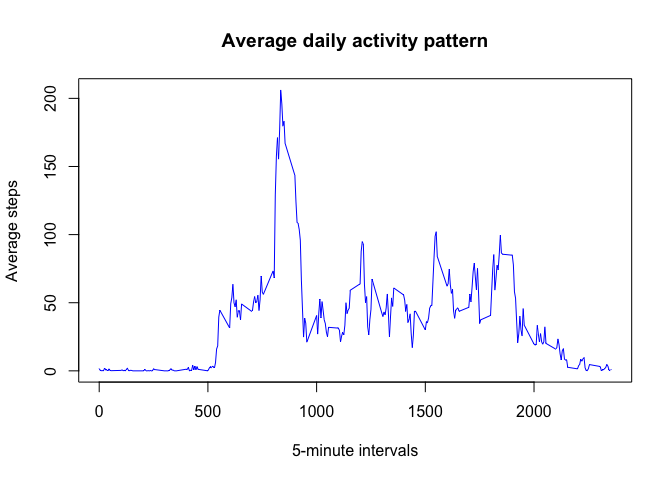

``` r
knitr::opts_chunk$set(echo=TRUE,results="show")
```

# Peer Assessment 1

## **Loading and preprocessing the data**

``` r
library(readr)
activity <- read_csv("activity.csv")
```

```
## Rows: 17568 Columns: 3
## ── Column specification ────────────────────────────────────────────────────────
## Delimiter: ","
## dbl  (2): steps, interval
## date (1): date
## 
## ℹ Use `spec()` to retrieve the full column specification for this data.
## ℹ Specify the column types or set `show_col_types = FALSE` to quiet this message.
```

## Here we calculate the total number of steps per day

``` r
library(dplyr)
```

```
## 
## Attaching package: 'dplyr'
```

```
## The following objects are masked from 'package:stats':
## 
##     filter, lag
```

```
## The following objects are masked from 'package:base':
## 
##     intersect, setdiff, setequal, union
```

``` r
activity_steps<-activity %>%
  group_by(date)%>%
  summarise(total_steps=sum(steps, na.rm=TRUE))
activity_steps
```

```
## # A tibble: 61 × 2
##    date       total_steps
##    <date>           <dbl>
##  1 2012-10-01           0
##  2 2012-10-02         126
##  3 2012-10-03       11352
##  4 2012-10-04       12116
##  5 2012-10-05       13294
##  6 2012-10-06       15420
##  7 2012-10-07       11015
##  8 2012-10-08           0
##  9 2012-10-09       12811
## 10 2012-10-10        9900
## # ℹ 51 more rows
```

## What is mean total number of steps taken per day? The mean number of steps per day is 9354, while the median is 10395.

``` r
summary(activity_steps$total_steps)
```

```
##    Min. 1st Qu.  Median    Mean 3rd Qu.    Max. 
##       0    6778   10395    9354   12811   21194
```

## We construct the histogram to show the distribution of the total steps per day.

``` r
hist(activity_steps$total_steps,
     main="Total steps per day",
     xlab = "Number of steps",
     breaks = 10,
     col="magenta")
```

<!-- -->
## The total number of steps taken per day is 570608.

``` r
sum(activity_steps$total_steps)
```

```
## [1] 570608
```

## **What is the average daily activity pattern?**
## Now we create a time series plot to visualise the average steps made on 5-minute intervals.

``` r
x<- activity%>%
  group_by(interval)%>%
  summarise(averageSteps=mean(steps, na.rm=TRUE))
```


``` r
with(x,plot(interval,averageSteps,
            pch=23,
            col="blue",
            type="l",
            xlab="5-minute intervals",
            ylab="Average steps",
            main="Average daily activity pattern"))
```

<!-- -->

## the 5-minute interval with the most number of steps is 835, witg an average of 206 steps.


``` r
max_interval<- x[which.max(x$averageSteps), ]
max_interval
```

```
## # A tibble: 1 × 2
##   interval averageSteps
##      <dbl>        <dbl>
## 1      835         206.
```

## **Imputing missing values**
## We have a total of 2304 NA values in the activity dataset.

``` r
sum(is.na(activity))
```

```
## [1] 2304
```

## So in order to fill those NAs, we merge the data set grouped by intervals with the main dataset.

``` r
data_filled<-merge(activity,x,by="interval")
data_filled$steps[is.na(data_filled$steps)]<-data_filled$averageSteps
```

```
## Warning in data_filled$steps[is.na(data_filled$steps)] <-
## data_filled$averageSteps: number of items to replace is not a multiple of
## replacement length
```
## And we check that the new dataset has indeed 0 NAs.

``` r
sum(is.na(data_filled))
```

```
## [1] 0
```

## Now we are creating a histogram of the total number of steps taken each day, without any NAs.We notice that the plot looks identical as the plot with the NA values.

``` r
data_filled2<-data_filled%>%
group_by(date)%>%
summarize(total_steps2=sum(steps,na.rm=TRUE))
```

``` r
hist(data_filled2$total_steps2,
     main="Total steps per day (without NAs)",
     xlab = "Number of steps",
     breaks = 10,
     col="magenta")
```

<!-- -->

## The median is also the same (10395), but the mean is a little higher, namely 9371. This indicates that the NA values skew the results and make them less accurate. In this case, though, the difference isn't so significant.  

``` r
summary(data_filled2$total_steps2)
```

```
##    Min. 1st Qu.  Median    Mean 3rd Qu.    Max. 
##      41    6778   10395    9371   12811   21194
```

## **Are there differences in activity patterns between weekdays and weekends?**

``` r
library(dplyr)

unique_days<-unique(data_filled$date)
day_names<-weekdays(as.Date(unique_days))
day_names
```

```
##  [1] "Monday"    "Friday"    "Sunday"    "Tuesday"   "Saturday"  "Thursday" 
##  [7] "Saturday"  "Friday"    "Wednesday" "Sunday"    "Sunday"    "Thursday" 
## [13] "Friday"    "Tuesday"   "Monday"    "Thursday"  "Tuesday"   "Wednesday"
## [19] "Sunday"    "Friday"    "Sunday"    "Tuesday"   "Monday"    "Thursday" 
## [25] "Monday"    "Saturday"  "Sunday"    "Thursday"  "Friday"    "Sunday"   
## [31] "Saturday"  "Friday"    "Wednesday" "Tuesday"   "Friday"    "Thursday" 
## [37] "Wednesday" "Tuesday"   "Thursday"  "Saturday"  "Wednesday" "Monday"   
## [43] "Wednesday" "Friday"    "Friday"    "Wednesday" "Tuesday"   "Monday"   
## [49] "Thursday"  "Sunday"    "Saturday"  "Wednesday" "Saturday"  "Monday"   
## [55] "Thursday"  "Saturday"  "Wednesday" "Monday"    "Tuesday"   "Monday"   
## [61] "Tuesday"
```

``` r
data_filled<-data_filled%>%
  mutate(day_name = weekdays(as.Date(date)),
         day_type = ifelse(day_name %in% c("Saturday", "Sunday"), "weekend", "weekday"))  

data_weekdays<-data_filled%>%
  group_by(interval,day_type)%>%
  summarise(avgSteps=mean(steps))
```

```
## `summarise()` has grouped output by 'interval'. You can override using the
## `.groups` argument.
```


``` r
library(ggplot2)
ggplot(data = data_weekdays, aes(interval,avgSteps))+
  geom_line()+
  facet_grid(day_type~.)+
  labs(x = "5-minute interval",
       y="Average number of steps")
```

<!-- -->

## we can observe that, whereas during weekdays the average number of steps peaks in the 570-1000 minute intervals and then decreases for the rest of the intervals, during the weekends the avg number of steps seems more consistent across intervals, without outstanding peaks.


